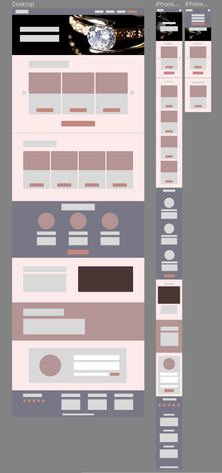
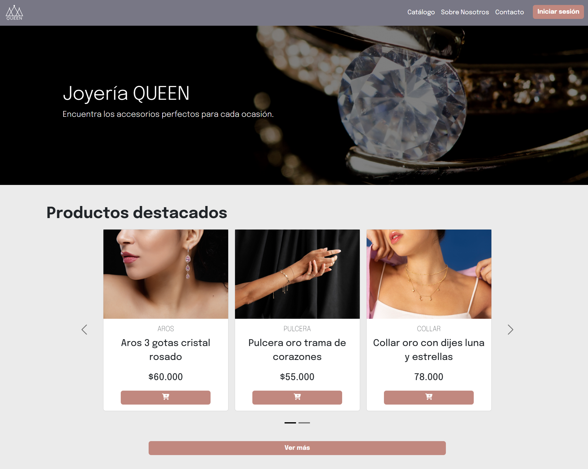
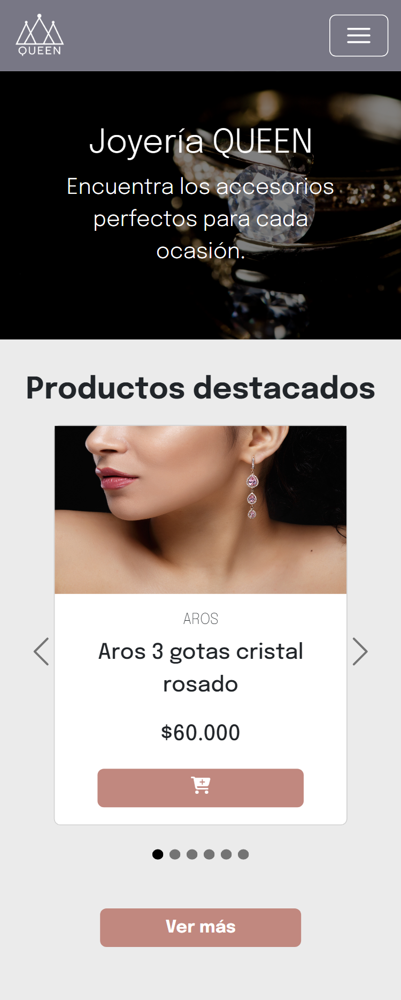

Proyecto 1: Landing de Ventas
# **Landing Page Joyería QUEEN**

## **Descripción:**
Para este proyecto se decidió crear una landing page para una joyería, en la cual se mostrara los productos que venden, categorias de estos, los servicios que proveen y una pequeña descripción de su ubicación.

Además de esto, se incorporan elementos de toda página web, tales como: un header con el logo del negocio y enlaces principales; una seccion de registro de usuario (en este caso en una página separada a la principal); y un footer que incluye los enlaces de redes sociales y enlaces secundarios.

Para esto, primero se realizó un diseño a través de la aplicación figma, el cual se muestra a continuación:

Luego se paso a desarrollar la página utilizando HTML5 semántico y CSS para lograr tanto la versión desktop como mobile.

## **Features:**
Para el desarrollo del proyecto se utilizaron diferentes tecnologías, tales como:
- Aplicación Figma: Para el desarrollo del diseño inicial de la página web.
- Bootstrap: Incorporación de variados componentes del framework para agilizar el desarrollo del prototipo y facilitar el Responsive Web Design.
- Fontawesome: Para la incorporación de diferentes íconos.

## **Objetivos:**
El proyecto se enfoca en la creación de un prototipo de una landing page de ventas; con los siguientes objetivos específicos:
1. Prototipado simple de la página a crear.
2. Utilización de HTML5 semántico.
3. Aplicación de selectores CSS. 
4. Aplicación de Responsive Web Design.

## **Demo:**
A continuación se presenta un enlace a la demo del proyecto.

https://ferramirez99.github.io/Proyecto1/